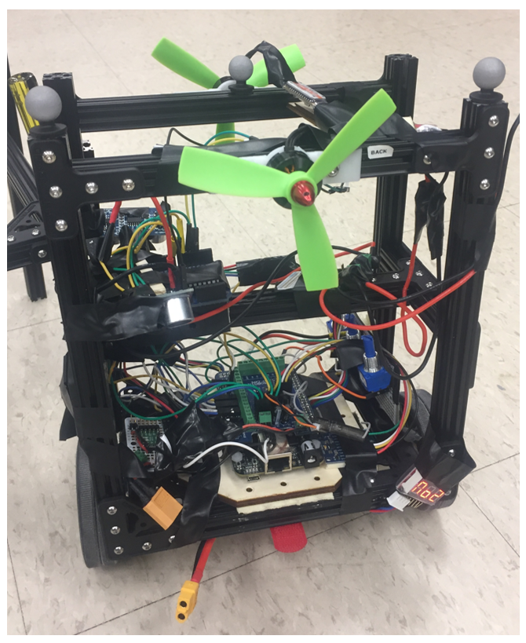

# balance-gyrodometry-robot

Blance Bot:

  

The main objective of this project is to implement a gyrodometric-based dead-reckoning navigation system on a differential drive robot, and to control the pitch angle, velocity and position of the robot using a cascade control scheme and sensor feedback to maintain balance while traversing a commanded path even when disturbance is introduced in the system. Various test cases are implemented to test robot navigation and analyze resultant error. Optitrack motion tracking system provides ground truth values that are compared against the robot's gyrodometry and odometry data. The project also introduces a propeller design as a possible additional control system that can balance the robot even beyond tipping angles (even though it's a trivial part).

More details please see [project paper](./misc/gyrodometric-based-navigation.pdf).

## Acknowledgment

This project is based on ROB550 in University of Michigan.

Code contributors: Zihang Wei (wzih@umich.edu), Boliang Liu (boliang@umich.edu), Rajashree Ravi (rajravi@umich.edu).

We would like to thank Prof. Ella Atkins, course instructor, for scientific guidance, Dr. Peter gaskell, lab instructor, for providing us with the proper equipment set and guidance throughout the experimentation process as well as lab sessions.

## License

autonomous-quadrotor-with-manipulator is distributed under the [MIT license](./LICENSE).