# balance-gyrodometry-robot

Blance bot:

  

The main objective of this project is to implement a gyrodometric-based dead-reckoning navigation system on a differential drive robot, and to control the pitch angle, velocity and position of the robot using a cascade control scheme and sensor feedback to maintain balance while traversing a commanded path even when disturbance is introduced in the system. Various test cases are implemented to test robot navigation and analyze resultant error. Optitrack motion tracking system provides ground truth values that are compared against the robot's gyrodometry and odometry data. The project also introduces a propeller design as a possible additional control system that can balance the robot even beyond tipping angles (even though it's a trivial part).

**More technical details please see** [project paper](./misc/gyrodometric-based-navigation.pdf).

**Some videos can be seen in links as below**:

[Turning while balance](https://youtu.be/QYu1Cye-YmU)

[Running for one square](https://youtu.be/KdWuRw1v8Zw)

## Hardware Architecture

Hardwares are listed in figure below:

  

* **Beaglebone Black(BBB)**: Beaglebone is a low-power, open-source, single-board computer, running Debian OS. In this project, because of certain kernel patch problems, we can only use it as a near real-time control system. This near real-time system though, proves sufficient for the implementation of all desired functionalities like the cascade control scheme, and data acquisition through IMU interrupts,etc.

* **Breakout Cape**: The Breakout Cape is an extension and interface of the Beaglebone board. It has screw terminals for power, twelve GPIO pins, seven ADC channels.  two UARTs, one I2C bus (I2C2), one SPI bus (SPI0) and a second SPI bus that can be run in real time from the programmable real-time units (PRUs) and five 3-pin headers for hobby servos. This is used to primarily isolate and protect the BBB from potentially damaging back EMFs produced by the motors.

* **Motor Module**: This includes a brushed DC motor operating at 12V, a 34:1 ratio gear box, a 48 ticks/shaft rotation disc, and an incremental quadrature encoder.

* **Motor Driver**: Two MAX14870 Single Brushed DC Motor Driver Carrier are used to take a low-current control signal and then turn it into a higher-current signal that can drive the two brushed DC wheel motors.

* **IMU**: MPU-9250 (IMU) contains an accelerometer, gyro and a magnetometer and has a special digital motion processor that can output fused orientation data in the form of quaternions and Tait-Bryan (Euler) angles.

* **DSM2 Receiver**: This is used to communicate with the RC transmitter for RC controlled driving and is bound to a particular controller which is configured to have channels 2 and 3 for linear and angular velocities.

* **Voltage Regulator Board**: A 5V/2A voltage regulator board is used to downsize the voltage from 12V(power for the motors) to 5V(power for Beaglebone board and other circuits).

* **Arduino Uno**: It is an open source, real-time microprocessors board from which time-accurate data from ultrasonic sensor can be obtained to control the propeller module.

* **Untrasonic Module**: HC-SR04 is an ultrasonic distance sensor module that is used to perceive the distance to the ground.

* **Wifi Dongle**: We use the Wifi module to build communication channel between laptop and Beaglebone.

* **ESC module**: The electronic speed control module is an electronic circuit used to vary an electric motor's speed and direction.It is used to control our propeller motors through the Arduino board.

* **Potentiometer**: The potentiometer module we built is used to tune PID parameters. The voltage of potentiometers can be read by Beaglebone ADC module. This module increases the efficiency of tuning parameters as we can dynamically change the PID value without having to recompile code everytime we need to change values.

Enhanced Quadrature Encoder Pulse (eQEP) decoder module is built into the BBB's TI Sitara ARM processor. The TI eQEP hardware peripheral that is integrated into the BeagleBone processor can accurately decode quadrature encoded pulses. The unit allows one to attach a quadrature encoder to the SoC directly and have it handle the counting of the encoder ticks, versus needing an external controller such as an Arduino to do the decoding process. This module gives us high speed data from the encoder and the IMU external interrupt timer makes the time interval and frequency (200Hz) at which data is obtained very accurate. 

## Software Architecture

A multi-thread software system is implemented for the control of the Balance Bot. The main thread is designed for path and balance control and optional threads such as printing thread and lcm message publishing thread are integrated for debugging and to display in real-time the robot state.

  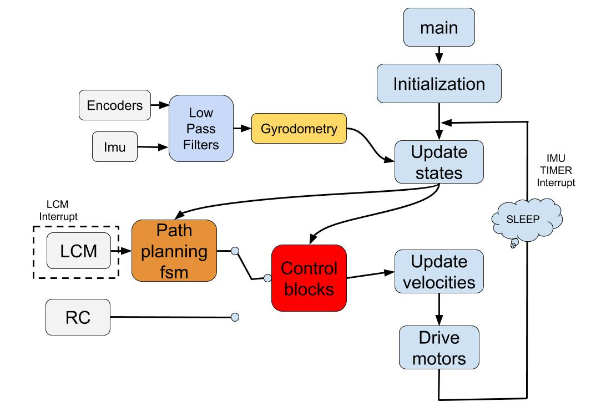

The main event-driven thread architecture is shown in Fig. \ref{fig: software_architech}. After device initialization, the robot falls into sleep to reduce power consumption and waits for interrupts. Two types of interrupts can wake up the robot. One is the IMU timer interrupt, which is set at the I2C's highest communication rate between Beaglebone and IMU. Once the interrupt occurs, the program updates robot's states, including current speed, heading and pitch angles. The other is the LCM subscription interrupt. When the robot receives messages on certain channels, it will wake up and update its path control state.

After updating states, the balanced bot is now able to follow commands from either the path published over LCM or the control signal given by the RC transmitter, to move as expected while maintaining balance. Control blocks are responsible for converting commands into desired forward and turning velocities of the robot and further into pulse width modulated(PWM) signals for both wheels. 

## State Machine and Decision Making Architecture

The state machine is used by the program to determine the next step that needs to be taken by the robot. The state of the robot is continously checked before setting any new forward or angular velocities. Users connect with the robot over `CONTROLLER_PATH` channel and send `robot_path_t` message containing a sequence of poses (position and orientation) for the controller to achieve. Additionally, the robot can also be commanded to poses set in GUI `botgui`.

  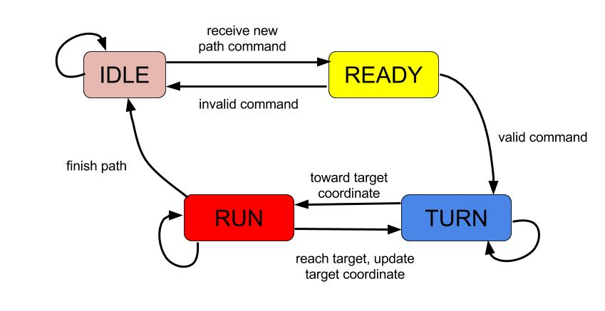

## Localization and State Prediction

We used both encoder, IMU, and a combination of encoder and IMU for test, and found gyrodometry works better.

### Gyrodometry

Odometry is based on the assumption that wheel revolutions can be translated into linear displacement but this assumption is invalid in certain cases. For instance, if one of the wheels in the differential drive robot slipped or encountered uneven surfaces, the encoders on the wheel would still register revolutions but the robot would not have linear displacement as modeled by odometry. To reduce this error, we also use gyroscope data from IMU to supplement the odometry. The yaw angle obtained from IMU was passed through a low pass filter to reduce spikes in measurements and then the difference in yaw (heading angle) for time step was calculated and compared to that obtained through odometry.

The implementation of gyrodometry ensured that even when the robot’s position was disturbed while driving, the robot could recover its heading to a certain extent as it could identify that the wheel had slipped and the actual change in heading was different from that obtained through odometry. The gyroscope calibration sequence was required to be performed before every trial, as the gyroscope was sensitive to both vibrations and temperature and the data from the gyroscope needed to be passed through a low pass filter before it could be used. 

## Control System

For control systems, a two-layer scheme is implemented as shown below:

  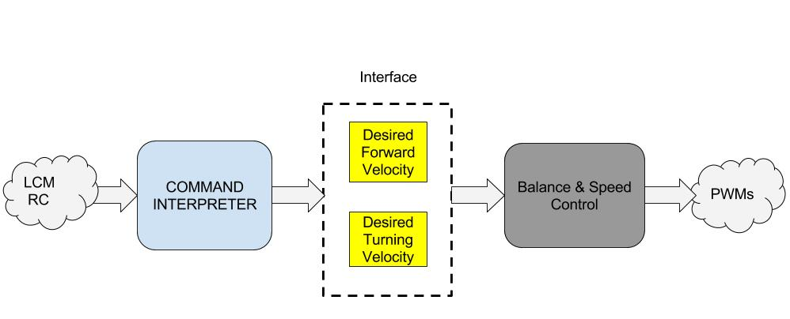

The first layer of the control system is Command Interpreter, which is used to convert input commands into robot's desired moving velocity. The second layer is Balance and Movement Speed Controller, which enables the robot to move at a certain required speed while keeping balance. Output of the second layer is PWM for the wheels. The highest frequency for Command Interpreter block is 10HZ, and for Balance Speed Control Block is 200HZ. 

Path Following Diagram:

  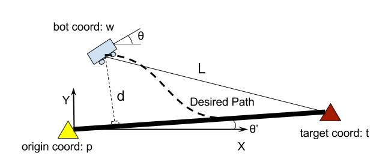

Path Following Controller:

  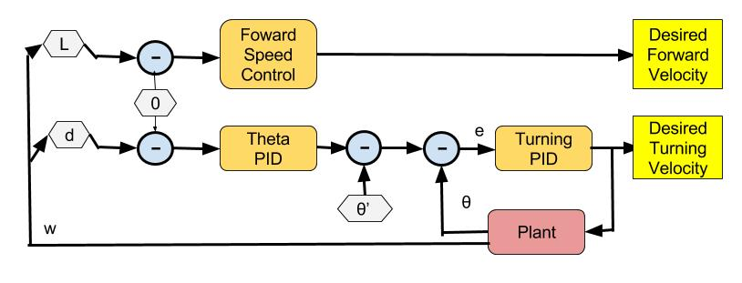

RC Velocity Control:

  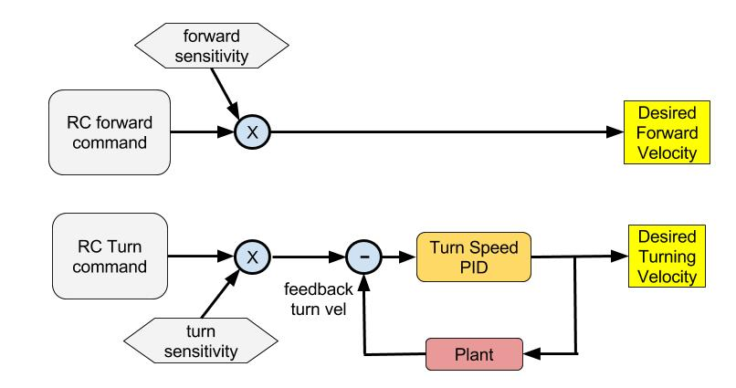

Balance and Speed Control:

  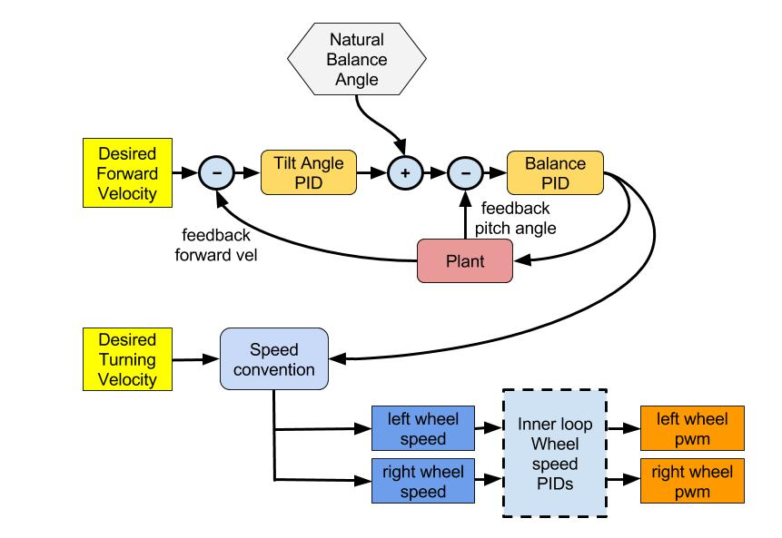

## Results Analysis

The following discussion details the results of the various tasks that were set for us and includes an analysis of the log data that was obtained from both the Optitrack and the robot.

### Driving in a square with caster wheels

We command the robot (with caster wheels) to drive a 1m long square path three times to see the bias and error in odemetry and gyrodometry implementations.

Odometry with wheels mode trajectory map:

  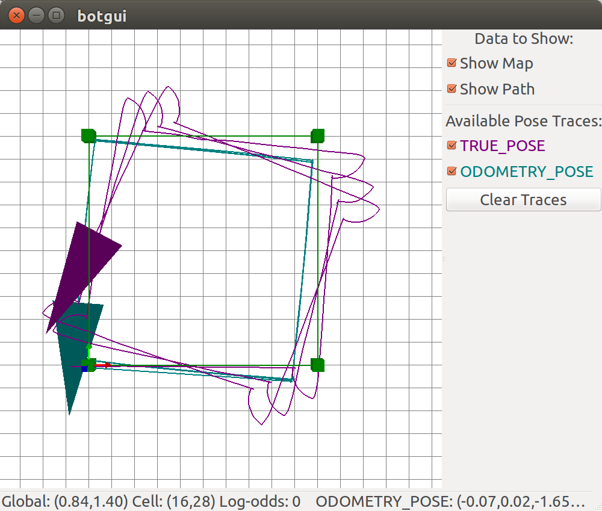

Path and error plot of robot with odometry and caster wheel:

  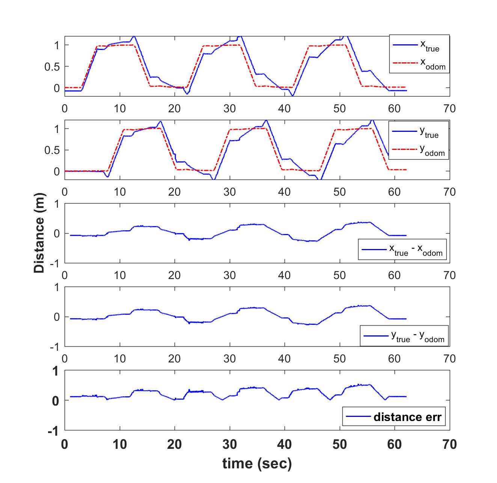

Path trace of robot with gyrodometry and caster wheels:

  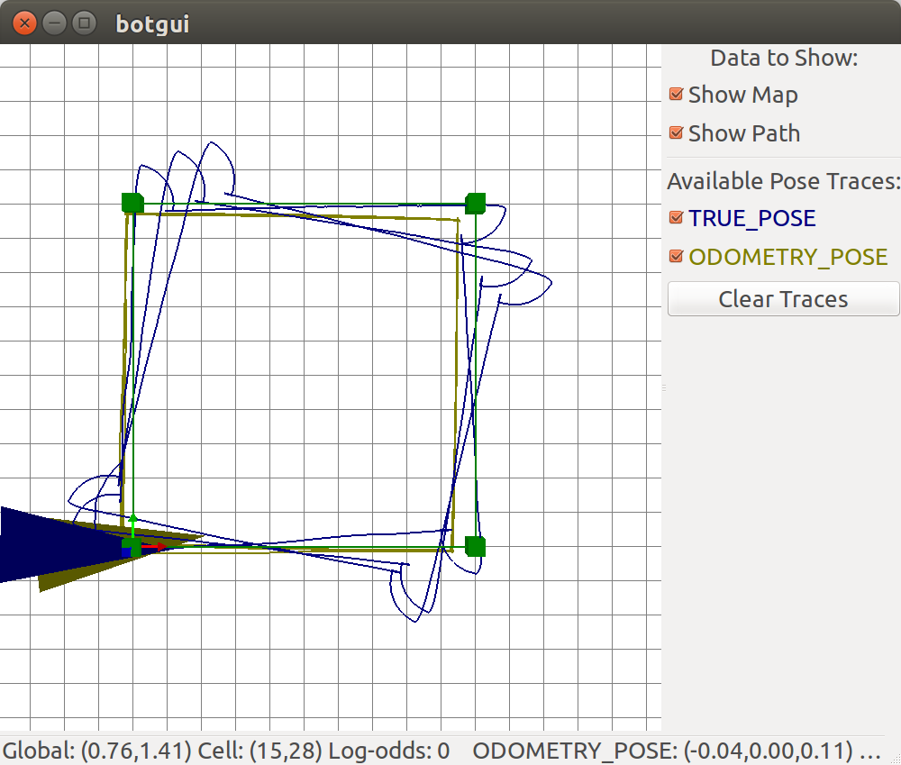

While driving in a square, it was seen that the robot stopped abruptly at each corner which jerked the caster wheel up momentarily before turning on spot. This behavior was predictable at each corner and this also confirmed the fact that the robot consistently accumulated more drift and error in every consecutive round in a predictable manner. From the data, it can be seen that the errors for each round lie within a certain range and that the performance of the robot is better when gyrodometry is applied rather than odometry.

Wheel slippage over smooth surfaces causes error in orientation that results in increasing positional errors in odometry over time. As gyrodometry accounts for such slipping with its IMU data, the error in position is significantly reduced. However, we find that yaw angle still drifts over time. Even after calibration, the rate of drift in yaw can only be limited to a certain range and not completely eliminated. 

### RC Driving

Three test cases were used to test the effectiveness of the control scheme: holding a stationary waypoint, turning on spot and over a distance, and moving along a straight line. 

Path traces for RC controlled driving mode - turning:

  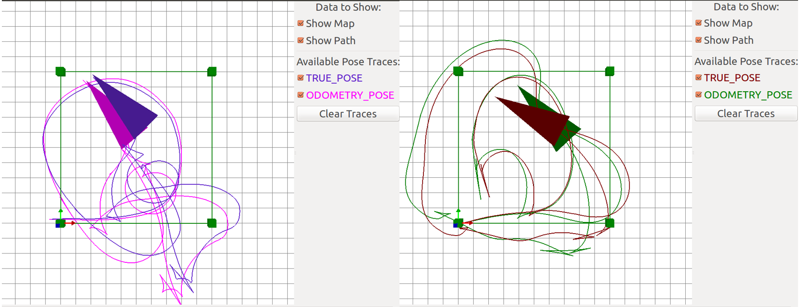

RC controlled driving mode - Holding a waypoint:

  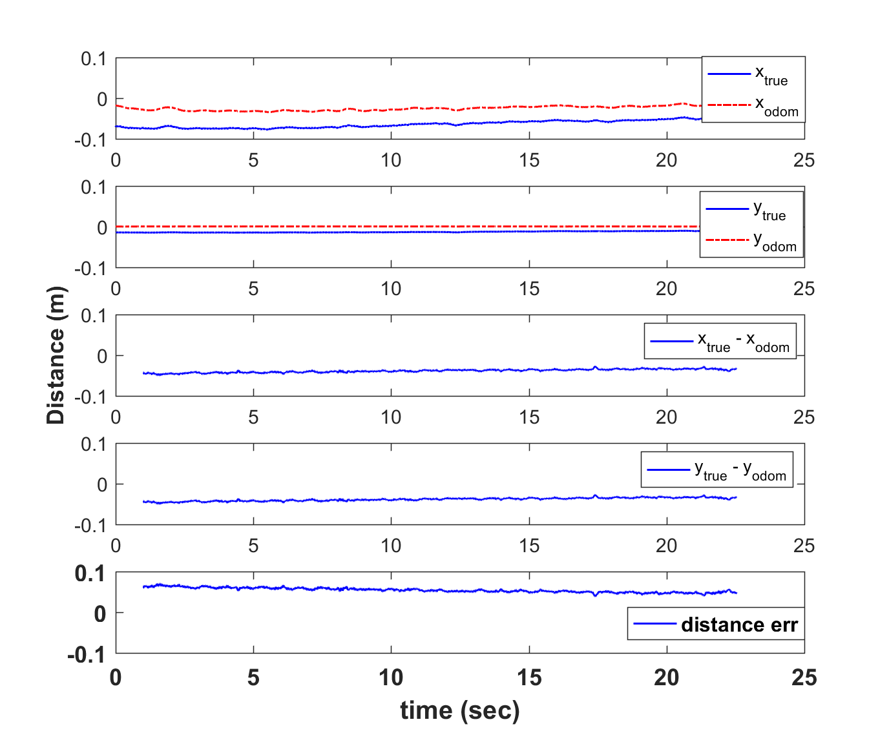

RC controlled driving mode - pure translation:

  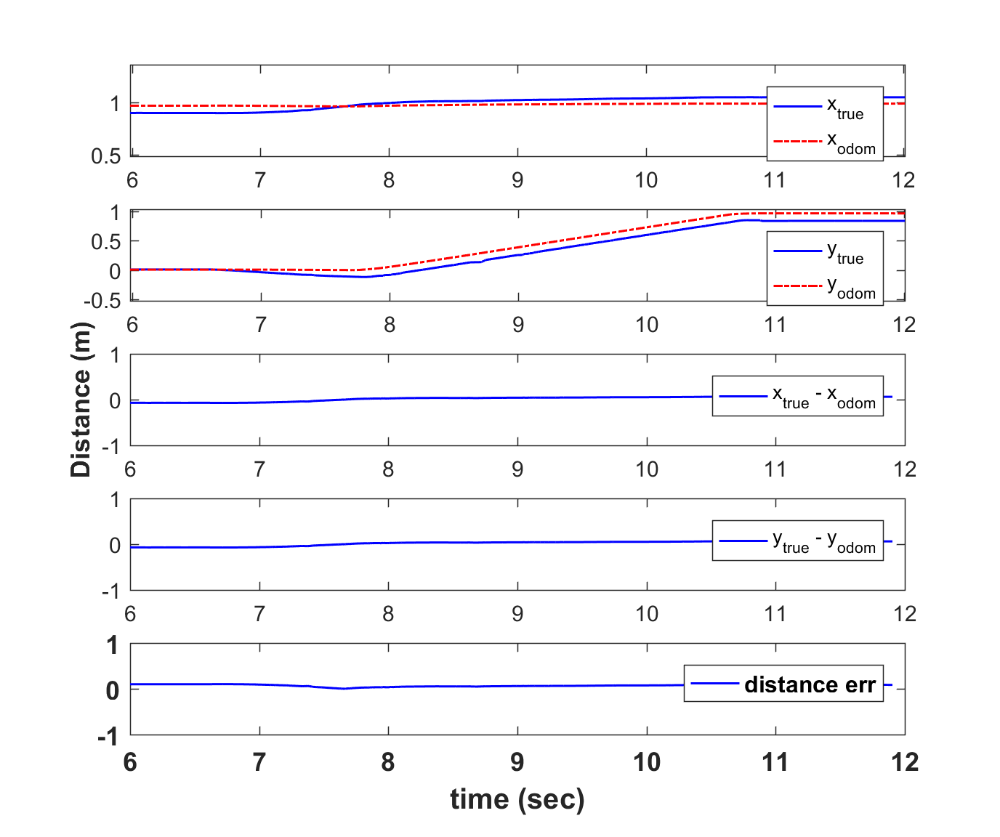

RC controlled driving - turning:

  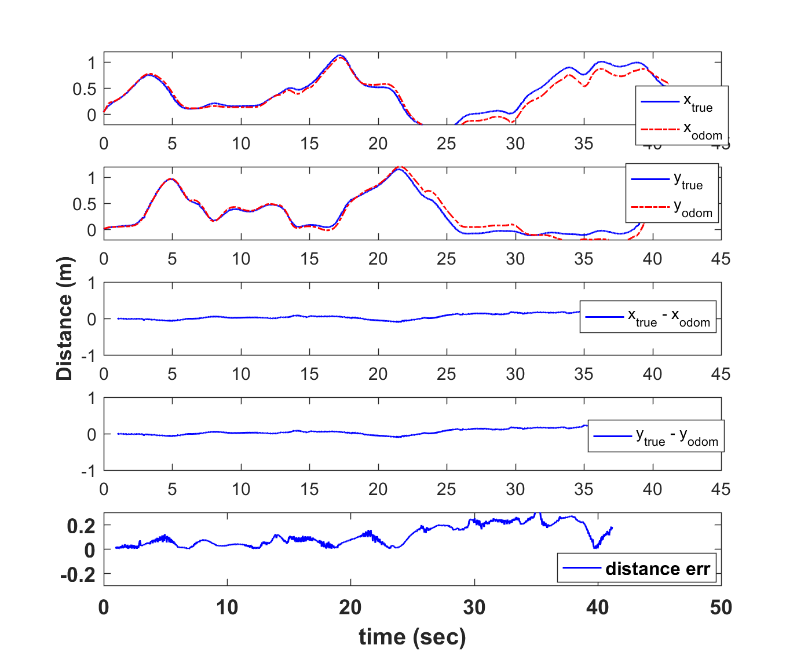

### Driving in a square without caster wheel

We find that the performance of driving in a square with a  caster wheel and the performance of driving in a square without a caster wheel works better when gyrodometry is applied rather than pure odometry.

The performance of the robot when not equipped with a caster wheel is better and we attribute it to the reason that the caster wheel in our design is not in the center, and the friction gives a bias to the turning velocity, which disturbs the controller. Since the accumulated bias for each square is constant and predictable, a reasonable turning speed offset and a small angle error check could enhance the performance of the square driving. However, the speed offset method doesn't make sense in real world indoor navigation. A better idea would be to use more reliable methods such as SLAM (Simultaneous localization and mapping).

Path traces for robot with balancing with gyrodometry:

  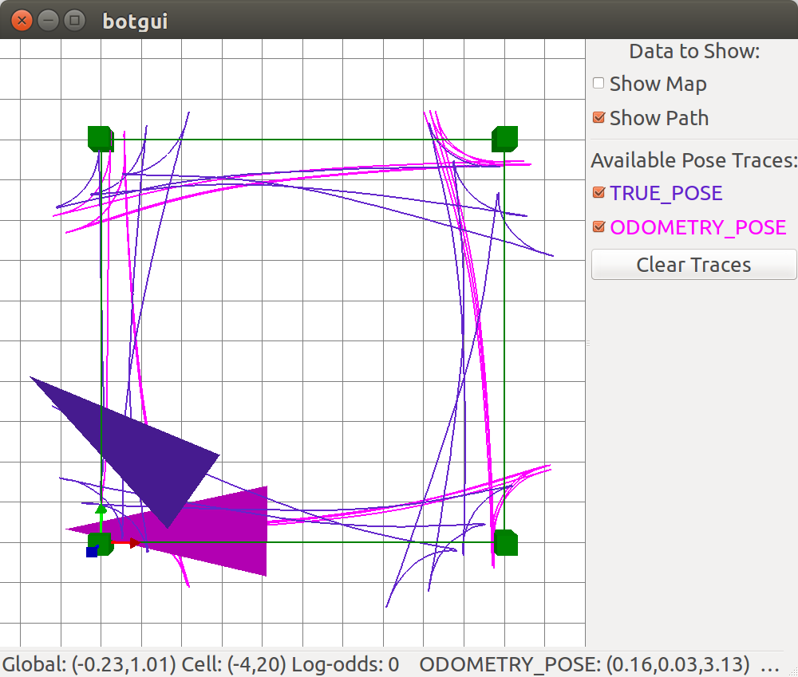

Balancing and gyrodometry without caster wheel:

  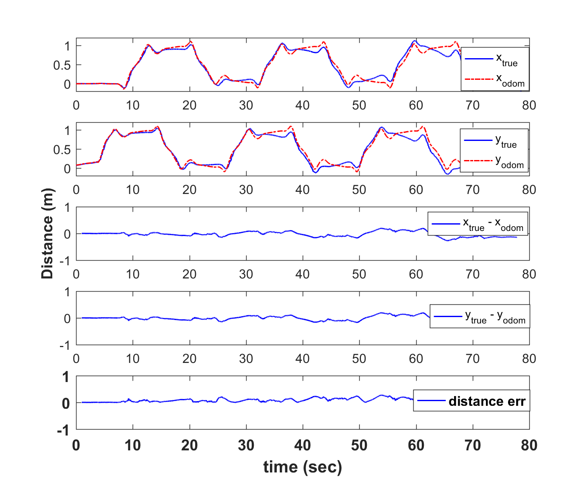

## Acknowledgment

This project is based on ROB550 in University of Michigan.

Code contributors: Zihang Wei (wzih@umich.edu), Boliang Liu (boliang@umich.edu), Rajashree Ravi (rajravi@umich.edu).

We would like to thank Prof. Ella Atkins, course instructor, for scientific guidance, Dr. Peter gaskell, lab instructor, for providing us with the proper equipment set and guidance throughout the experimentation process as well as lab sessions.

## License

autonomous-quadrotor-with-manipulator is distributed under the [MIT license](./LICENSE).